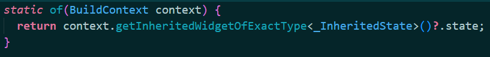

### myWeiXin

#### 踩坑
+ 在浏览器中展示UI时，如果当前路由需要其他路由传递参数，那么如果直接打开给页面，页面会保存，提示参数为NULL，那么只能通过在根组件进行路由导航的时候，给与一个默认值。（个人解决方案，未寻到标准解决方案）
+ Expand组件只能在弹性模型中，Row,Column,或者flex

### 问题
+ 注意：在开发的时候，使用的是局域网，所以如果使用手机进行调试，手机必须连接进同一个局域网络中

+ （通讯录页面）由于是通过listener widget监听PointerDown事件，所以导致Column无法进行滑动，当手指按下时，PointerDown触发，页面就跳转了，所以无法进行滑动

+ TextField具有默认的 contentPadding，所以给TextField设置固定高度时，且高度小于padding+文字高度，就会在设置居中时导致，看起来不是那么居中：上面多出的部分就是padding，padding垂直方向置于0，以后结果达到预期，取消边框后，设置填充色，居中效果失效。暂时没有解决办法。

+ 更新完静态资源以后，需要重新启动服务，不然flutter找不到资源路径

+ material组件必须在scaffold组件中使用，不然会报错

+ Expanded 只能作为 Flex 的孩子，因为Column和Row继承自Flex，所以Expanded也可以在Column和Row中使用

+ 

  getInheritedwidgetOfExactType<_InheritedState>中的\_InheritedState是必须的，不然flutter会认为引用的是InheritedWidget实例，从而导致无法正确访问属性。